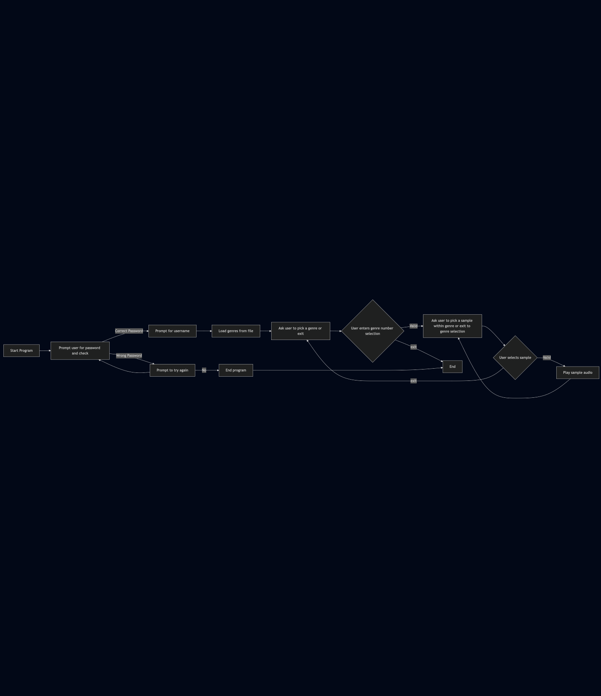

# The sample player

This project is a simple soundboard, including multiple previewable genres of music, each with several samples. Access is restricted unless you have the password: "Soundboard".


## How to develop and run this program from the command line

To run this program, in this directory, write this command into your terminal: 

```bash
python main.py
```

## Features 

- prompt user for password
- user is prompted for their username
- the user is prompted to choose from a list of previewable music genres 
- when user selects genre, 9 samples appear on screen
- when selected these samples will play a sound 
- to select a sample, the user will enter the number of the sample and the sample will play

## Flowchart


