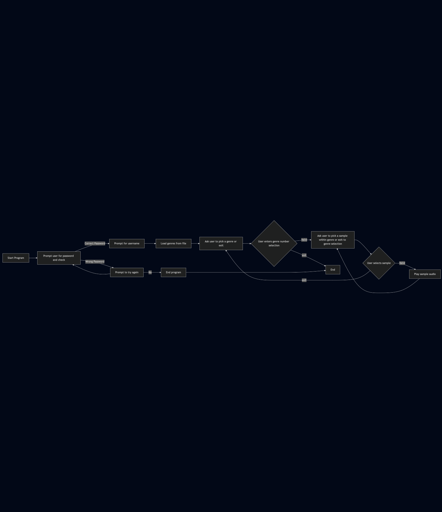

# The sample player

This project is a simple soundboard, including multiple previewable genres of music, each with several samples. Access is restricted unless you have the password: "Soundboard".


## How to develop and run this program from the command line

To run this program, in this directory, write this command into your terminal: 

```bash
python main.py
```

## Features 

- prompt user for password
- user is prompted for their username
- the user is prompted to choose from a list of previewable music genres 
- when user selects genre, 9 samples appear on screen
- when selected these samples will play a sound 
- to select a sample, the user will enter the number of the sample and the sample will play

## Flowchart




# Reflection
During this project I learned new techniques and furthered my knowledge in others. 
- I learned how to play sound through python and load .wav files from relative paths.
- I learned how to handle user input and how to deliver feedback to the user.
- I had to learn how to iterate through lists of data.

This project also challenged my problem solving process. When I encountered errors in the program, I sometimes had to completley rethink the problem and solve it from there. For example it took me sometime to figure out how relative and absolute file paths work. Learning how to share global state between keywords also took me a minute to figure out.

 I pride myself on the fact that I chose something that challenged me and didnt pick an easier project that would have that would have been easier. I wouldn't have learned anything new. Instead, I had a long bug log, with puzzling problems that needed to be researched. And I had to learn features of python that we did not cover in class.

 Overall I am happy because I had to really think to complete the picture I had in my head. 

